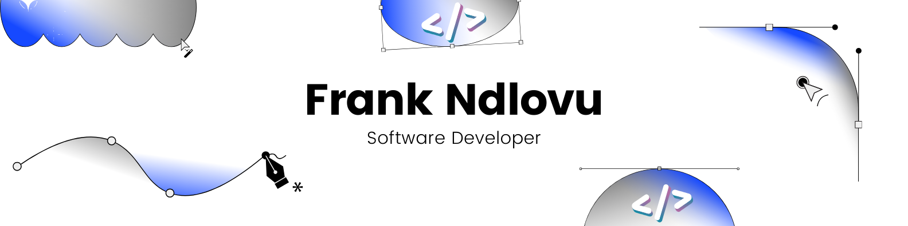
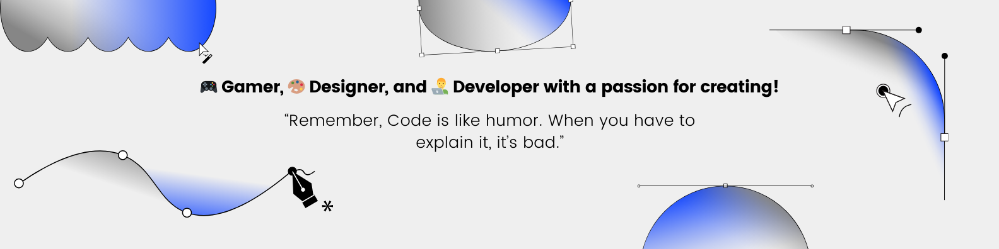

# 📢  About Me:
Hey there! I'm an Information Systems grad 🎓 who loves turning coffee into code and big ideas into working software. Whether it's crafting slick user interfaces or wiring up the backend magic, I enjoy solving real-world problems with tech.  
 
💻 What I'm good at: 
    - Writing clean code in JavaScript, Python, Java, C#, and more 
    - Building cool stuff with React, Node.js, .NET Core, & SQL 
    - Getting things done (bonus points if it's in an Agile sprint) 
    - Googling error messages like a pro 
 

⚡ **Fun Fact**: I can code, brew coffee, and play Fortnite 🎮 at the same time.  

🔗 I'm currently exploring the interesting field of Data Engineering. Thus, I'm always up for learning something new, collaborating on projects,or just geeking out over code. If you've got a project, an idea, or a bug you can't squash - hit me up! 
 
## 🌐 Socials:
 

# 💻 Tech Stack:
                   
# 📊 GitHub Stats:

  

  

  

## 🏆 GitHub Trophies

### ✍️ Random Dev Quote

    

---

